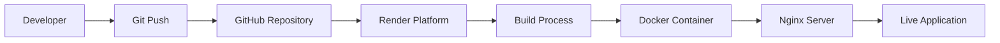

# Project Overview

This page provides comprehensive information about the Ranbridge Solutions Private Limited project, including architecture, technologies, and system design.

## 🏢 Company Information

**Ranbridge Solutions Private Limited** is a technology-driven company focused on delivering innovative IT solutions to businesses of all sizes.

### Company Details
- **Founded**: 2023
- **Type**: Private Limited Company
- **Headquarters**: Hyderabad, Telangana, India
- **Target Markets**: Startups, SMEs, and Enterprise clients
- **Core Services**: Web Development, Software Solutions, Cloud Services, Digital Marketing

## 🏗️ System Architecture

### High-Level Architecture
```
┌─────────────────────────────────────────────────────────┐
│                 User Interface Layer                    │
│  ┌─────────────────────────────────────────────┐    │
│  │        React Components (TypeScript)      │    │
│  │  ┌─────────────────────────────────┐    │    │
│  │  │    State Management    │    │    │
│  │  │    (React Hooks)     │    │    │
│  │  └─────────────────────────┘    │    │
│  │  Routing (React Router)       │    │
│  │  Styling (Tailwind CSS)       │    │
│  │  Animations (GSAP)             │    │
│  └─────────────────────────────────────┘    │
├─────────────────────────────────────────────────┤
│                 Build & Deployment Layer                │
│  ┌─────────────────────────────────────────────┐    │
│  │        Vite (Build Tool)              │    │
│  │  TypeScript (Compiler)               │    │
│  │  Tailwind CSS (PostCSS)             │    │
│  │  Asset Optimization                 │    │
│  └─────────────────────────────────────────────┘    │
├─────────────────────────────────────────────────┤
│                 Infrastructure Layer                   │
│  ┌─────────────────────────────────────────────┐    │
│  │        Render (Cloud Hosting)           │    │
│  │  Docker (Containerization)          │    │
│  │  Nginx (Web Server)              │    │
│  │  CDN (Static Assets)               │    │
│  └─────────────────────────────────────────────┘    │
└─────────────────────────────────────────────────┘
```

### Component Architecture
```
src/
├── components/
│   ├── Header.tsx           # Navigation & global UI
│   ├── Home.tsx             # Hero section & services
│   ├── About.tsx            # Company information
│   ├── Services.tsx          # Service offerings
│   ├── Domains.tsx           # Technical expertise
│   ├── Internship.tsx        # Internship programs
│   ├── Contact.tsx           # Contact form & info
│   ├── Footer.tsx            # Site footer
│   └── ...                  # Specialized components
├── App.tsx                 # Main application component
├── index.html              # HTML template
├── index.css               # Global styles
└── vite.config.ts          # Build configuration
```

## 🛠️ Technology Stack

### Frontend Technologies
- **React 19** - Component-based UI framework
- **TypeScript** - Type safety and better DX
- **Tailwind CSS** - Utility-first CSS framework
- **GSAP** - High-performance animations
- **Lucide React** - Modern icon library
- **React Router** - Client-side routing

### Build & Development Tools
- **Vite** - Fast build tool and dev server
- **ESLint** - Code quality and consistency
- **PostCSS** - CSS processing and optimization

### Deployment & Infrastructure
- **Render** - Cloud hosting platform
- **Docker** - Containerization and consistency
- **Nginx** - Production web server
- **GitHub** - Version control and CI/CD

## 🎨 Design System

### Color Palette
- **Primary**: Blue (`#0f172a`, `#2563eb`)
- **Secondary**: Slate (`#1e293b`, `#475569`)
- **Accent**: Amber (`#f59e0b`)
- **Neutral**: White/Gray variations

### Typography
- **Primary Font**: Inter (modern, clean)
- **Brand Font**: Syne (bold, impactful)
- **Accent Font**: Space Grotesk (technical, spacious)

### Design Principles
- **Mobile-First**: Responsive design approach
- **Accessibility**: WCAG 2.1 AA compliance
- **Performance**: Optimized for fast loading
- **Consistency**: Unified design language

## 📱 Responsive Design

### Breakpoints
- **Mobile**: `320px - 768px`
- **Tablet**: `768px - 1024px`
- **Desktop**: `1024px - 1920px`
- **Large Desktop**: `1920px+`

### Mobile Optimizations
- **Touch-Friendly**: Larger tap targets
- **Performance**: Lazy loading and optimization
- **Navigation**: Mobile menu with hamburger icon
- **PWA Support**: App shortcuts and offline capability

## 🔍 SEO Architecture

### Search Optimization Strategy
- **Technical SEO**: Meta tags, structured data, sitemaps
- **Content SEO**: Keyword optimization, quality content
- **Local SEO**: Google Business Profile, local listings
- **Performance**: Core Web Vitals optimization

### SEO Files Structure
```
public/
├── company-info.json     # Company information
├── opensearch.xml       # Browser search
├── manifest.json        # PWA manifest
├── organization.json    # Schema.org data
└── SEO-README.md       # Implementation guide
```

## 🚀 Deployment Architecture

### Production Deployment Flow


### Environment Configuration
- **Development**: Local development with hot reload
- **Staging**: Pre-production testing environment
- **Production**: Optimized build with CDN delivery

## 📊 Performance Metrics

### Core Web Vitals Targets
- **LCP**: < 2.5s (Largest Contentful Paint)
- **FID**: < 100ms (First Input Delay)
- **CLS**: < 0.1 (Cumulative Layout Shift)
- **TTI**: < 3.8s (Time to Interactive)

### Monitoring Tools
- **Google Search Console** - Search performance
- **Render Analytics** - Application monitoring
- **Lighthouse** - Performance auditing

## 🔐 Security Architecture

### Security Implementation
- **HTTPS Only**: All connections use SSL/TLS
- **Security Headers**: XSS protection, CSP, frame options
- **Input Validation**: Form sanitization and validation
- **Dependency Security**: Regular updates and vulnerability scanning

## 📞 Support & Maintenance

### Monitoring Strategy
- **Uptime Monitoring**: 99.9% uptime target
- **Error Tracking**: Comprehensive error logging
- **Performance Monitoring**: Real-time performance metrics
- **User Feedback**: Multiple feedback channels

---

*For detailed technical implementation, see the specific wiki pages in the navigation menu.*
